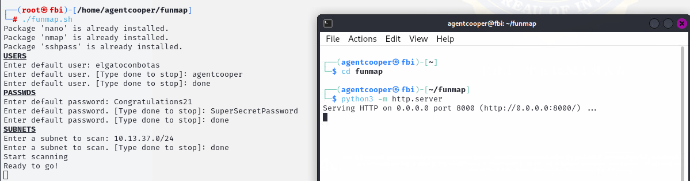
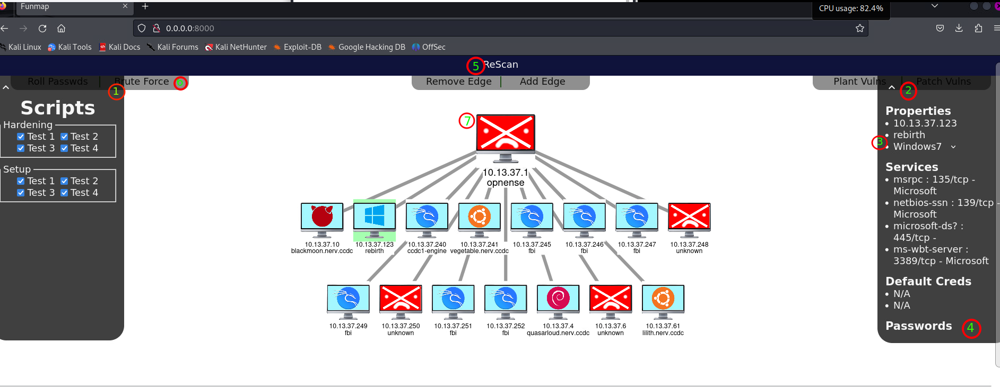

# zoo (funmap by pyukey)
F is for friends that blue team together. <br>
One-stop shop for blue team management.

## Installation

Make sure you're in your home directory and run `git clone https://github.com/pyukey/funmap.git`

## Running

```
cd funmap
sudo ./funmap.sh
```
Using your given default credentials, enter the users, passwords, and subnets for the scan. When it says you're `Ready to go!`, start a webserver in the `funmap/` directory: `python3 -m http.server`


## Features
Funmap supports many features including: 
- is super lightweight and requires minimal installs, allowing us to deploy and secure our network within minutes!
- a fully customizable network diagram (7)
- a password management service (3)
- a brute forcer to detect machines where default logins still work (6)
- a modular system to deploy or patch vulnerabilities across machines! (1)



1. Modular vulnerabilites located in `scripts` that you can deploy across any machines. The `patch` feature is used for blue-teaming, while the `plant` feature is used for red-teaming.

2. An info bar displaying properties of the selected machine

3. Hostname and distro are fully customizable, in case the initial scan fails

4. Funmap functions as a password manager, the default credentials that worked for the initial scan are displayed. Additionally, you will be able to search up the name of any user on that machine and retrieve their password!

5. Can scan again at any time by clicking **Rescan**. You can select specific nodes on the graph to scan. If none are selected, by default all machines will be scanned.

6. Similarly, there are a variety of buttons with different capabilites. You can roll passwords, brute force default credentials or deploy vulns|patches. Results will be output to the terminal you initially started funmap in.

7. Select machines by clicking them. Their info will be displayed in the info-box, and clikcing the buttons will run scripts on those machines. The graph can be zoomed, dragged around, and you can even add or remove edges using the buttons at the top.

## Modules

Located in the `modules` subdirectory. These are the 'animals' of the zoo, each providing functionality to the manager.

- `chipmunk` - Anything we need for backups, including creating, restoring, managing, and hosting backups.
- `chomp` - Host-based EDR. The module is responsible for deploying, starting it, collecting its logs, and health checks.
- `elk` - Automation scripts for deploying the Elastic Search stack.
- `flamingo` - Password change and management scripts. Able to parse `/etc/passwd` and `/etc/shadow` for misconfigurations.
- `hawk` - Initial scans of the network to populate the network diagram of zoo.
- `meerkat` - Generic service health checks (whatever `woodpecker` doesn't cover).
- `meow` - "Connector" module; responsible for establishing connections with targets and passing payloads through. Many modules will require `meow` for connecting.
- `nematode` - Gain visibility into service running on hosts and maps relationships between services (i.e. a web server has its database on a different host).
- `phoenix` - Automated firewall tasks.
- `suricata` - Automated suricata deployment. Automated connection to ELK.
- `woodpecker` - continuously runs login attempts to check for default credentials.
- `woof` - Interactive script that patches system and service misconfigurations, can run on a schedule.

# ToDo

- Implement password management
  - Use `modules/meow` as the connector, use `modules/chamaleon` for the password changer
  - encrypting so the files aren't stored in plaintext.
- Add LOTS of modules for tool setup
- Windows support (connect via WinRM, SMB)
- Create a version of funmap that runs on Windows
